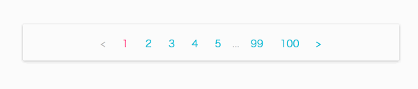

# material-ui-flat-pagination

[](https://travis-ci.org/szmslab/material-ui-flat-pagination)
[](https://coveralls.io/github/szmslab/material-ui-flat-pagination?branch=master)
[](https://www.npmjs.org/package/material-ui-flat-pagination)

A pagination component for [Material-UI](http://www.material-ui.com/#/) using Flat Button.

## Installation

```bash
npm install material-ui-flat-pagination --save
```
## Demo

[](https://szmslab.github.io/material-ui-flat-pagination/)

#### [Demo](https://szmslab.github.io/material-ui-flat-pagination/)

## Example

```javascript
import React from 'react';
import ReactDOM from 'react-dom';
import MuiThemeProvider from 'material-ui/styles/MuiThemeProvider';
import injectTapEventPlugin from 'react-tap-event-plugin';
import FlatPagination from 'material-ui-flat-pagination';

injectTapEventPlugin();

class Example extends React.Component {
  constructor() {
    super();
    this.state = {offset: 0};
  }

  handleTouchTap(offset) {
    this.setState({offset});
  }

  render() {
    return (
      <MuiThemeProvider>
        <FlatPagination
          offset={this.state.offset}
          limit={10}
          total={100}
          onTouchTap={(e, offset) => this.handleTouchTap(offset)}
        />
      </MuiThemeProvider>
    );
  }
}

ReactDOM.render(
  <Example/>,
  document.getElementById('app')
);
```

## Props

| Name | Type | Default | Description |
| -----| -----| ------- | ----------- |
| **`limit`** (required) | validateNumber |  | The number of rows per page. Allow a number greater than or equal to `1`.|
| **`offset`** (required) | validateNumber |  | The number of rows to skip. Allow a number greater than or equal to `0`.|
| **`total`** (required) | validateNumber |  | The total number of rows. Allow a number greater than or equal to `0`.|
| `className` | string |  | The css class name of the root element. |
| `currentPageLabelStyle` | object |  | Override the inline-styles of the button's label element of current page. |
| `currentPageStyle` | object |  | Override the inline-styles of the button element of current page. |
| `disabled` | bool | false | If true, the button will be disabled. |
| `disableTouchRipple` | bool | false | If true, the button's ripple effect will be disabled. |
| `hoverColor` | string |  | Color of button when mouse hovers over. |
| `nextPageLabel` | node | '>' | Label for the next page button. |
| `onClick` | func |  | Callback function fired when the button is clicked.<br><br>Signature:<br>`function(event: object, offset: number) => void`<br>event: Click event targeting the button.<br>offset: The number of new offset. |
| `onTouchTap` | func |  | Callback function fired when the button is touch-tapped.<br><br>Signature:<br>`function(event: object, offset: number) => void`<br>event: TouchTap event targeting the button.<br>offset: The number of new offset. |
| `otherPageLabelStyle` | object |  | Override the inline-styles of the button's label element of other pages except the current page. |
| `otherPageStyle` | object |  | Override the inline-styles of the button element of other pages except the current page. |
| `previousPageLabel` | node | '<' | Label for the previous page button. |
| `rippleColor` | string |  | Color for the ripple after button is clicked. |
| `reduced` | bool | false | Reduce the number of buttons displayed if set to true. |
| `style` | object |  | Override the inline-styles of the root element. |

## License

MIT, see [LICENSE](https://github.com/szmslab/material-ui-flat-pagination/blob/master/LICENSE) for details.
